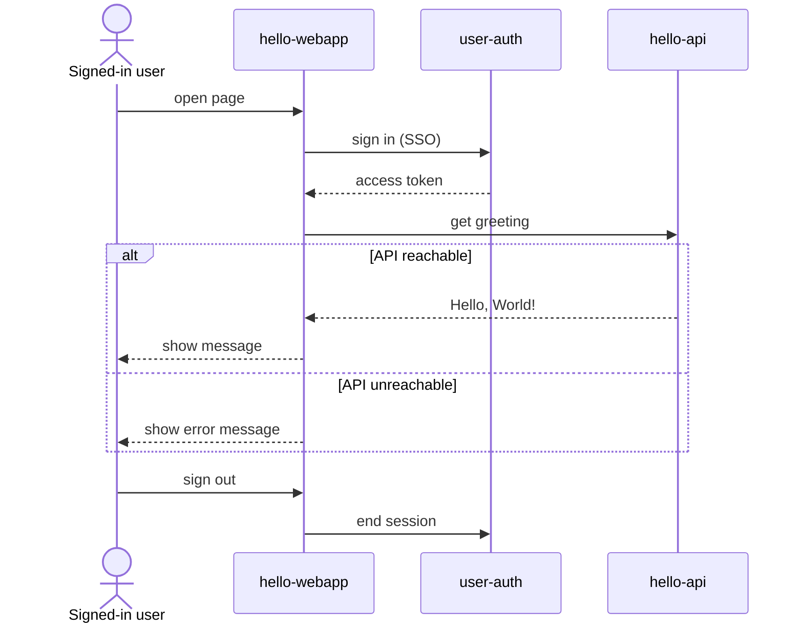

# View the greeting

A signed-in user opens the web app, which signs them in through SSO and shows the hello message fetched from the API; if the API is unreachable the page shows an error.

```mermaid
sequenceDiagram
    actor User as Signed-in user
    participant hello-webapp
    participant user-auth
    participant hello-api

    User->>hello-webapp: open page
    hello-webapp->>user-auth: sign in (SSO)
    user-auth-->>hello-webapp: access token
    hello-webapp->>hello-api: get greeting
    alt API reachable
        hello-api-->>hello-webapp: Hello, World!
        hello-webapp-->>User: show message
    else API unreachable
        hello-webapp-->>User: show error message
    end
    User->>hello-webapp: sign out
    hello-webapp->>user-auth: end session
```